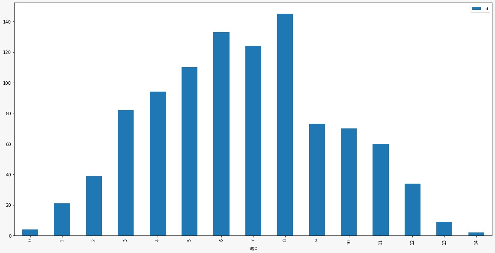
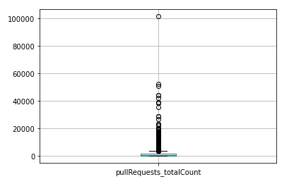
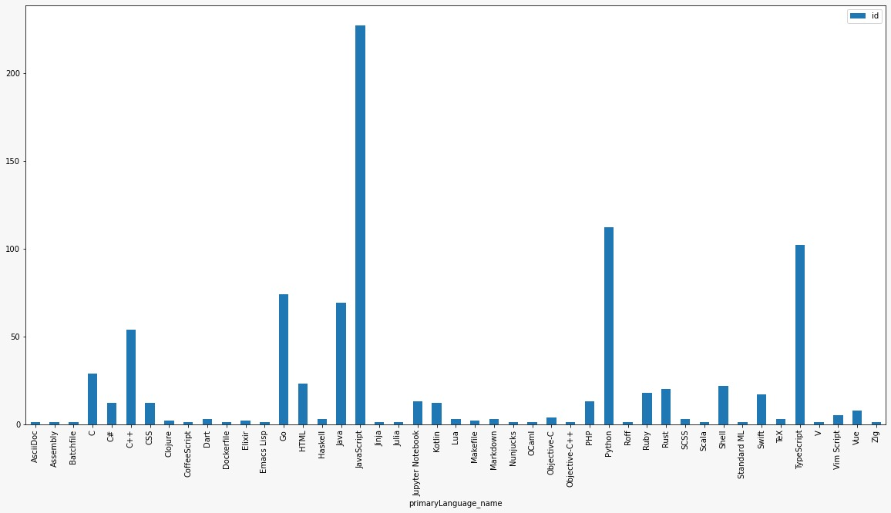
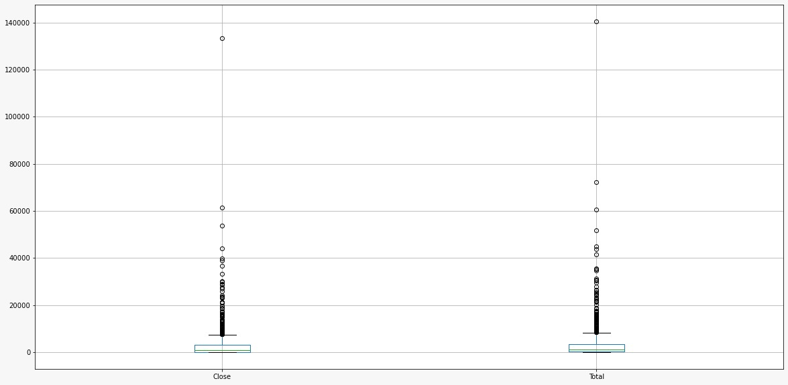

# Introdução

  

O GitHub é um serviço baseado em nuvem que hospeda um sistema de controle de versão (VCS) chamado Git. Ele permite que os desenvolvedores colaborem e façam mudanças em projetos compartilhados enquanto mantêm um registro detalhado do seu progresso. A plataforma reune mais de

60 milhões de usúarios e 150 milhões de repositorios. Ela permite por meio de uma API a consultas de dados e métricas dos repositorios publicos. Deste modo, iremos apresentar algumas questões e responde-las com base no resultado de consultas realizadas no GitHub e o processamento desses dados.

  

# Metodologia

  

Foi formulado uma hipose informal para cada questão descrita teorizada a partir do subjetivismo. Ao longo do trabalho iremos apresentar respostas fundadas nas pesquisas realizadas no GitHub.

  

##Questões de pesquisa e suas metricas:

  

**RQ 01.**. Sistemas populares são maduros/antigos?

	Métrica: idade do repositório (calculado a partir da data de sua criação)

  

**RQ 02.** Sistemas populares recebem muita contribuição externa?

  

	Métrica: total de pull requests aceitas

  

**RQ 03.** Sistemas populares lançam releases com frequência?

  

	Métrica: total de releases

  

**RQ 04.** Sistemas populares são atualizados com frequência?

  

	Métrica: tempo até a última atualização (calculado a partir da data de última atualização)

  

**RQ 05.** Sistemas populares são escritos nas linguagens mais populares (Links para um site externo.)?

  

	Métrica: linguagem primária de cada um desses repositórios

  

**RQ 06.** Sistemas populares possuem um alto percentual de issues fechadas?

  

	Métrica: razão entre número de issues fechadas pelo total de issues

  

## Hipóteses informais

  

**RQ 01.**  Sistemas populares são maduros/antigos?

  
Sim, acreditamos que por terem mais tempo, a popularidade do repositório seja maior.

  

**RQ 02.**  Sistemas populares recebem muita contribuição externa?

  

Sim, pois acreditamos que a maior parte dos repositórios populares são open source

  

**RQ 03.**  Sistemas populares lançam releases com frequência?

  

Sim, por serem repositórios mais maduros, acreditamos que possuem mais versões lançadas, tanto de melhorias quanto de conserto de bugs.

  

**RQ 04.**  Sistemas populares são atualizados com frequência?

Sim, acreditamos que para o projeto estar entre os populares devem possuir atualizações constantes

  

**RQ 05.**  Sistemas populares são escritos nas linguagens mais populares?

  

Sim, por serem linguagens populares e repositórios populares, acreditamos que estejam relacionados.

  

**RQ 06.**  Os sistemas populares possuem um alto percentual de issues fechadas?

  

Sim, pois acreditamos que são repositórios open source, então teria mais issues fechadas.

  

## Coleta de dados
A coleta de dados foi feita de forma automatizada através de um *script* desenvolvido em *javaScript*. O *script* criado  consome uma API propria do GitHub baseada em *GraphQL*.
Foi definido os seguintes dados para ser coletado dos repositorios:
* Nome do autor
* Data da criação
* Data de atualização
* Linguagem principal
* Total de estrelas
* Total de *pullRequests*
* Total de *releases*
* Total de *Issues*
* Total de *Issues* fechadas
#### 1º Etapa
A criação do *script* para buscar os dados nos cem repositorios mais populares do *GitHub*.
#### 2º Etapa
O escalonamento do *script* para buscar os dados nos mil repositorios mais populares do *GitHub* e salvar esses dados em um arquivo *.csv*.

## Analise dos dados

Para a analise dos dados foi utilizada a biblioteca *Pandas* do *Python*.

# Resultado
**RQ 01.** Sistemas populares são maduros/antigos?

Sim, como mostra o gráfico a maior parte dos repositorios populares são mais maduros, pois possuem de quatro a oito anos.

**RQ 02** Sistemas populares recebem muita contribuição externa?

Não, podemos afirmar que eles recebem contribuição externa, mas não pode ser considerada como grande parte da contrubuição, pois mais da metade dos repositorios não possuem mil *pullRequests* aceitos.

**RQ 03.** Sistemas populares lançam releases com frequência?

Não, 43,8% possuem menos de dez realeases lançadas.

**RQ 04.** Sistemas populares são atualizados com frequência?

Sim, todos os mil repositorios foram atualizados até o mês de agosto/2022

**RQ 05.** Sistemas populares são escritos nas [linguagens mais populares (Links para um site externo.)](https://octoverse.github.com/)?

Sim, porém existem repositorios populares escritos em linguagens menos populares.

**RQ 06.** Sistemas populares possuem um alto percentual de issues fechadas?

Sim, somente 26,9% dos repositorios possuem menos de 200 *issues* fechadas.

## Conclusão

Os resultados obtidos para as questões: 01, 04, 05 e 06 foram conforme o esperado. Porém para as outras questões os resultados foram diferentes do previsto durante a metodologia, conforme os dados:
* **RQ 03** 43,8% possuem menos de dez realeases lançadas.
* **RQ 02** 68,3% dos sistemas possuem menos de mil *pullRequests* aceitos.
Os resultados encontrados para as questões 
